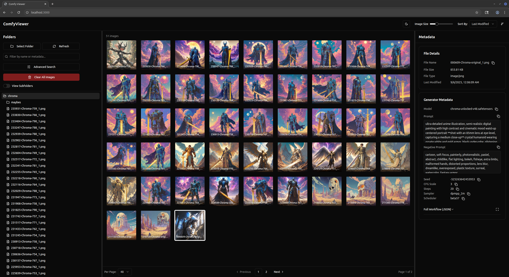
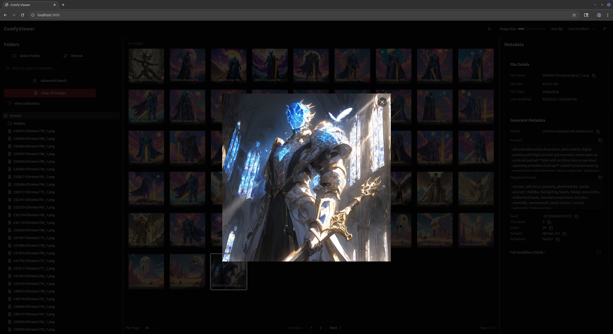

# ComfyViewer

**A local-first, in-browser image and metadata viewer for your AI-generated images, with a special focus on ComfyUI workflows.**

[](https://opensource.org/licenses/Apache-2.0)

ComfyViewer is a tool designed for artists, developers, and enthusiasts who work with AI image generation tools. It allows you to load an entire folder of images directly into your browser, where you can browse, search, and inspect the rich metadata embedded within them. Your files are never uploaded to a server; all processing and storage happens locally on your machine using your browser's own database.

## Screenshots

*ComfyViewer*


*Full image view*

## ✨ Features

-   **100% Local & Private**: Your images are processed and stored in your browser's IndexedDB. They never leave your computer.
-   **Efficient & Fast**: Built with performance in mind, using lazy loading for images and an indexed database for quick searches.
-   **Rich Metadata Parsing**: Automatically extracts and displays detailed generation data from ComfyUI-generated images, including prompts, seeds, samplers, models, LoRAs, and the full JSON workflow.
-   **Advanced Search & Filtering**: Quickly find images by filtering on any metadata field, such as prompt keywords, model names, or sampler types.
-   **Familiar File-Tree Interface**: Navigate your image folders with a classic file-tree structure, just like on your desktop.
-   **Customizable Layout**: Features resizable panels and a customizable grid view to tailor the interface to your liking.
-   **Arrow Keys Support**: Quickly cycle through your images to analyze quickly

## 🛠️ Tech Stack

ComfyViewer is built with a modern, simple, and effective tech stack:

-   **Framework**: [Next.js](https://nextjs.org/) (App Router)
-   **Language**: [TypeScript](https://www.typescriptlang.org/)
-   **Styling**: [Tailwind CSS](https://tailwindcss.com/)
-   **UI Components**: [Shadcn/UI](https://ui.shadcn.com/)
-   **Local Storage**: [IndexedDB](https://developer.mozilla.org/en-US/docs/Web/API/IndexedDB_API) for all image and metadata storage.
-   **Icons**: [Lucide React](https://lucide.dev/)

## 🚀 Getting Started

To run ComfyViewer on your local machine, follow these steps.

### Prerequisites

-   [Node.js](https://nodejs.org/en/) (v18 or later is recommended)
-   A package manager like `npm`, `yarn`, `pnpm`, or `bun`.

### Installation

In your project terminal, clone ComfyViewer:
```bash
git clone git@github.com:christian-saldana/ComfyViewer.git
```

Then install the necessary dependencies:
```bash
npm install
# or
yarn install
# or
pnpm install
```

### Running the Application

Once the dependencies are installed, run the server:
```bash
npm run dev
```
or 
```bash
npm run build
npm run start
```


Now, open [http://localhost:3000](http://localhost:3000) in your browser to start using ComfyViewer.

## 📖 How to Use

1.  Once the application is running, click the **"Select Folder"** button.
2.  Your browser's file dialog will open. Choose a directory that contains your AI-generated images.
3.  The application will process the folder, extract metadata, and store everything in your browser. This might take a moment for very large folders.
4.  Once loaded, you can browse your images, click on them to view metadata, and use the search tools to filter your collection.

## 🤝 Contributing

Contributions are welcome! If you have ideas for new features, bug fixes, or improvements, please feel free to open an issue or submit a pull request.

## 📄 License

This project is open-source and available under the license specified in the [LICENSE](LICENSE) file.